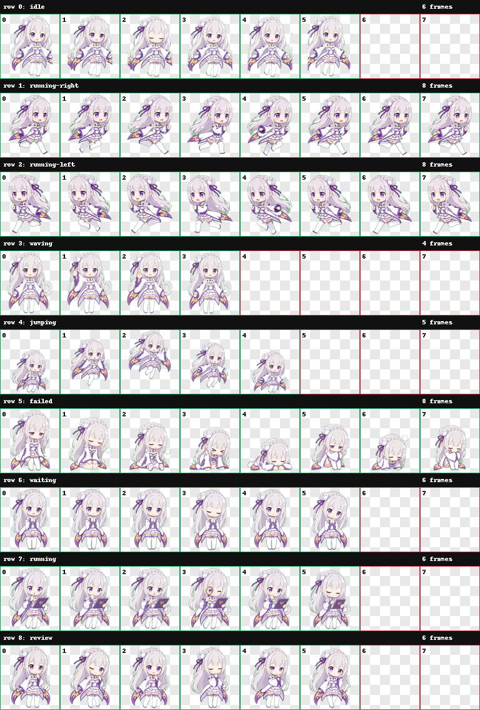

# Lilac Sprite Pet

一个银发、紫白配色、幻想风格的 Codex 桌宠项目。  
这是一个个人 AI 辅助创作项目，主要用于学习、展示和自用。



## 预览

| 状态 | 动画 |
| --- | --- |
| 待机 idle |  |
| 向右移动 running-right |  |
| 向左移动 running-left |  |
| 挥手 waving |  |
| 跳跃 jumping |  |
| 失败 failed |  |
| 等待 waiting |  |
| 工作 running |  |
| 审阅 review |  |

## 文件说明

```text
.
├─ pet.json              # Codex 自定义桌宠配置
├─ spritesheet.webp      # 1536x1872 桌宠精灵图
├─ contact-sheet.png     # 所有动作帧的检查图
├─ previews/             # 每个状态的 GIF 预览
└─ docs/
   ├─ validation.json    # 精灵图规格校验结果
   └─ review.json        # 动作帧检查结果
```

## 安装方法

把 `pet.json` 和 `spritesheet.webp` 复制到下面这个目录：

```text
C:\Users\<你的用户名>\.codex\pets\lilac-sprite\
```

例如：

```powershell
$src = "D:\Codex\projects\lilac-sprite-pet"
$dst = "$env:USERPROFILE\.codex\pets\lilac-sprite"

New-Item -ItemType Directory -Force -Path $dst | Out-Null
Copy-Item "$src\pet.json" "$dst\pet.json" -Force
Copy-Item "$src\spritesheet.webp" "$dst\spritesheet.webp" -Force
```

然后重启 Codex，在桌宠设置里选择 `Lilac Sprite`。

## 规格

- 精灵图尺寸：`1536x1872`
- 网格：`8 列 × 9 行`
- 单帧尺寸：`192x208`
- 格式：`WebP`
- 背景：透明
- 校验：`docs/validation.json` 中 `ok: true`

## 说明

这个项目是个人创作的原创 chibi 桌宠形象，使用 AI 辅助流程生成和整理。  
请不要将它表述为任何动画、游戏、公司或权利方的官方角色、官方素材或授权作品。

本仓库不包含原始参考图，也不包含第三方平台截图。

## 授权

本项目默认保留所有权利。你可以查看和学习本仓库内容，但不要直接用于商业用途、再分发素材包或声称为官方素材。

详细说明见 [NOTICE.md](./NOTICE.md)。
